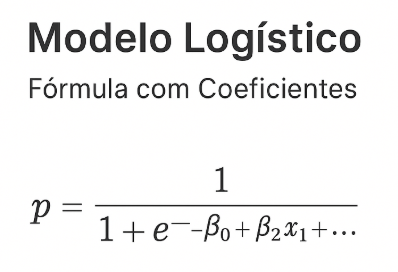

# 🛣️ Predição de Acidentes na BR‑116

Este projeto utiliza um modelo de **regressão logística** para estimar a probabilidade de ocorrência de acidentes graves na rodovia BR‑116, com base em variáveis como tipo de veículo, período do dia e localização (faixa de quilometragem).

---

## 📥 Downloads dos Dados Brutos (ANTT)

Abaixo estão os links para visualização e download dos arquivos originais disponibilizados pela ANTT.  
Esses arquivos são usados como entrada no pipeline automatizado.

> **Fonte oficial:** Agência Nacional de Transportes Terrestres (ANTT)

### 🔗 Arquivos RAW

| Arquivo | Descrição | Link |
|--------|-----------|------|
| demonstrativo_acidentes.txt | Arquivo demonstrativo de acidentes da ANTT | <a href="https://drive.google.com/file/d/1c3ABHCpNPmUiXE8j3jxtPaJ7132TvgWc/view?usp=sharing" target="_blank">Abrir no Google Drive</a> |
| demonstrativo_acidentes_dicionario_dados.pdf | Dicionário de dados oficial da ANTT | <a href="https://drive.google.com/file/d/1XaF6uW-VMaFlt6fWDeLLc6ftUGX0Xot5/view?usp=sharing" target="_blank">Abrir PDF</a> |

---

## 🗂️ Coeficientes do Modelo

| Coeficiente | Variável               | Valor     |
|-------------|------------------------|-----------|
| β₀          | Intercepto             | -2.4073   |
| β₁          | Automóvel              | -0.5701   |
| β₂          | Bicicleta              | 2.0264    |
| β₃          | Caminhão               | 0.0389    |
| β₄          | Moto                   | 0.4407    |
| β₅          | Ônibus                 | 0.0731    |
| β₆          | Outros                 | 0.3423    |
| β₇          | Utilitário             | -0.0702   |
| β₈          | Período manhã          | -1.2201   |
| β₉          | Período noturno        | -0.5018   |
| β₁₀         | Período vespertino     | -1.2032   |
| β₁₁         | Km 25–50               | 0.1423    |
| β₁₂         | Km 50–75               | 0.3256    |
| β₁₃         | Km 75–100              | 0.2390    |
| β₁₄         | Km 100–125             | 0.0074    |
| β₁₅         | Km 125–150             | -0.2197   |
| β₁₆         | Km 150–175             | -0.0685   |
| β₁₇         | Km 175–200             | 0.1911    |
| β₁₈         | Km 200–225             | 0.0102    |
| β₁₉         | Km 225–250             | 0.0723    |

---

## 🖼️ Visualização do Modelo

A função logística transforma uma combinação linear de variáveis explicativas em uma probabilidade entre 0 e 1:

---

## 📊 Interpretação dos Coeficientes

- **Coeficientes positivos** indicam aumento na probabilidade de acidente grave.  
  Exemplo: Bicicleta (β₂ = 2.0264) → maior risco associado.

- **Coeficientes negativos** indicam redução na probabilidade.  
  Exemplo: Período manhã (β₈ = -1.2201) → menor risco relativo.

- **Faixas de Km_cat** ajudam a identificar trechos mais críticos da rodovia.  
  Exemplo: Km 50–75 (β₁₂ = 0.3256) → trecho com maior risco estimado.

---

## 🧠 Aplicações

- Monitoramento de trechos críticos  
- Planejamento de ações preventivas  
- Apoio à tomada de decisão em segurança viária  
- Visualização em dashboards (Looker Studio, Supabase)

---

## 👨‍💻 Autor

**Paulo Dias** 
— Consultor Data Driven

- 🌐 Portfólio: <a href="https://paulopconsult-bit.github.io/" target="_blank">https://paulopconsult-bit.github.io/</a>  
- 💼 LinkedIn: <a href="https://www.linkedin.com/in/paulo-data-driven/" target="_blank">https://www.linkedin.com/in/paulo-data-driven/</a>  
- 💬 WhatsApp: <a href="https://wa.me/5513991245656" target="_blank">Iniciar conversa</a>  

---